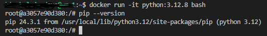
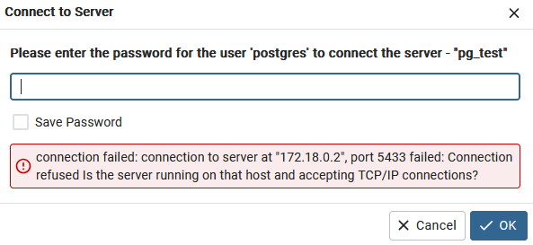
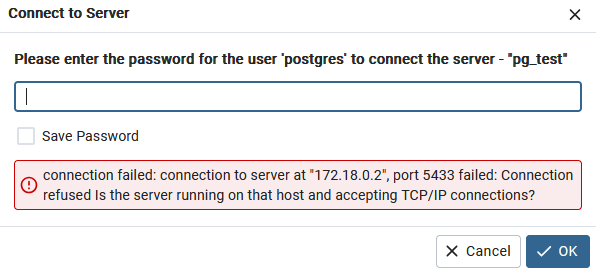
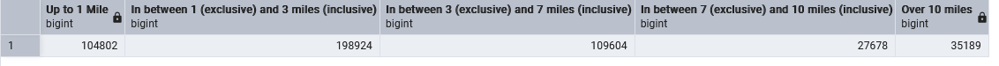
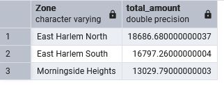
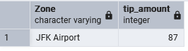

# Module 1 Homework: Docker & SQL

In this homework we'll prepare the environment and practice
Docker and SQL

When submitting your homework, you will also need to include
a link to your GitHub repository or other public code-hosting
site.

This repository should contain the code for solving the homework. 

When your solution has SQL or shell commands and not code
(e.g. python files) file format, include them directly in
the README file of your repository.


## Question 1. Understanding docker first run 

Run docker with the `python:3.12.8` image in an interactive mode, use the entrypoint `bash`.

What's the version of `pip` in the image?

- **24.3.1** **
- 24.2.1
- 23.3.1
- 23.2.1

```docker
docker run -it python:3.12.8 bash
```

Explanation :

- `docker run` : starts a new docker container
- `it` : enables interactive mode with a pseudo-TTY
- `python:3.12.8` : specifies the docker image to use
- `bash` : entrypoint `bash`




## Question 2. Understanding Docker networking and docker-compose

Given the following `docker-compose.yaml`, what is the `hostname` and `port` that **pgadmin** should use to connect to the postgres database?

```yaml
services:
  db:
    container_name: postgres
    image: postgres:17-alpine
    environment:
      POSTGRES_USER: 'postgres'
      POSTGRES_PASSWORD: 'postgres'
      POSTGRES_DB: 'ny_taxi'
    ports:
      - '5433:5432'
    volumes:
      - vol-pgdata:/var/lib/postgresql/data

  pgadmin:
    container_name: pgadmin
    image: dpage/pgadmin4:latest
    environment:
      PGADMIN_DEFAULT_EMAIL: "pgadmin@pgadmin.com"
      PGADMIN_DEFAULT_PASSWORD: "pgadmin"
    ports:
      - "8080:80"
    volumes:
      - vol-pgadmin_data:/var/lib/pgadmin  

volumes:
  vol-pgdata:
    name: vol-pgdata
  vol-pgadmin_data:
    name: vol-pgadmin_data
```

- postgres:5433
- localhost:5432
- db:5433
- **postgres:5432** **
- **db:5432** **

If there are more than one answers, select only one of them

The correct answers are `postgres:5432` and `db:5432`

For other answers, this is the error that occurs when using combination of hostname and port to connect to the Postgres database.

- postgres:5433



- localhost:5432


- db:5433




##  Prepare Postgres

Run Postgres and load data as shown in the videos
We'll use the green taxi trips from October 2019:

```bash
wget https://github.com/DataTalksClub/nyc-tlc-data/releases/download/green/green_tripdata_2019-10.csv.gz
```

You will also need the dataset with zones:

```bash
wget https://github.com/DataTalksClub/nyc-tlc-data/releases/download/misc/taxi_zone_lookup.csv
```

Download this data and put it into Postgres.

You can use the code from the course. It's up to you whether
you want to use Jupyter or a python script.

## Question 3. Trip Segmentation Count

During the period of October 1st 2019 (inclusive) and November 1st 2019 (exclusive), how many trips, **respectively**, happened:
1. Up to 1 mile
2. In between 1 (exclusive) and 3 miles (inclusive),
3. In between 3 (exclusive) and 7 miles (inclusive),
4. In between 7 (exclusive) and 10 miles (inclusive),
5. Over 10 miles 

Answers:

- 104,802;  197,670;  110,612;  27,831;  35,281
- **104,802;  198,924;  109,603;  27,678;  35,189** **
- 104,793;  201,407;  110,612;  27,831;  35,281
- 104,793;  202,661;  109,603;  27,678;  35,189
- 104,838;  199,013;  109,645;  27,688;  35,202


Query :

```sql
SELECT
	SUM(CASE WHEN trip_distance <= 1 THEN 1 ELSE 0 END) AS "Up to 1 Mile",
	SUM(CASE WHEN trip_distance > 1 AND trip_distance <= 3 THEN 1 ELSE 0 END) AS "In between 1 (exclusive) and 3 miles (inclusive)", 
	SUM(CASE WHEN trip_distance > 3 AND trip_distance <= 7 THEN 1 ELSE 0 END) AS "In between 3 (exclusive) and 7 miles (inclusive)",
	SUM(CASE WHEN trip_distance > 7 AND trip_distance <= 10 THEN 1 ELSE 0 END) AS "In between 7 (exclusive) and 10 miles (inclusive)",
	SUM(CASE WHEN trip_distance > 10 THEN 1 ELSE 0 END) AS "Over 10 miles"
FROM tripdata AS td
WHERE DATE(td.lpep_pickup_datetime) >= '2019-10-01' 
	AND DATE(td.lpep_dropoff_datetime) < '2019-11-01';
```




## Question 4. Longest trip for each day

Which was the pick up day with the longest trip distance?
Use the pick up time for your calculations.

Tip: For every day, we only care about one single trip with the longest distance. 

- 2019-10-11
- 2019-10-24
- 2019-10-26
- **2019-10-31** ** 

Query :

```sql
SELECT td.lpep_pickup_datetime::date AS date_trip,
     MAX(trip_distance) AS largest_distance
FROM tripdata AS td
GROUP BY td.lpep_pickup_datetime::date
ORDER BY largest_distance DESC
LIMIT 1;
```


## Question 5. Three biggest pickup zones

Which were the top pickup locations with over 13,000 in
`total_amount` (across all trips) for 2019-10-18?

Consider only `lpep_pickup_datetime` when filtering by date.
 
- East Harlem North, East Harlem South, Morningside Heights
- East Harlem North, Morningside Heights
- Morningside Heights, Astoria Park, East Harlem South
- Bedford, East Harlem North, Astoria Park

Query :

```sql
SELECT tz."Zone",
	SUM(td.total_amount) AS total_amount
FROM public.tripdata AS td
INNER JOIN public.taxizone AS tz
    ON td."PULocationID" = tz."LocationID"
WHERE td.lpep_pickup_datetime::date = '2019-10-18'
GROUP BY tz."Zone"
HAVING SUM(td.total_amount) > 13000;
```




## Question 6. Largest tip

For the passengers picked up in October 2019 in the zone
named "East Harlem North" which was the drop off zone that had
the largest tip?

Note: it's `tip` , not `trip`

We need the name of the zone, not the ID.

- Yorkville West
- JFK Airport
- East Harlem North
- East Harlem South


Query :

```sql
SELECT tzdo."Zone",
	td.tip_amount AS tip_amount
FROM public.tripdata AS td
INNER JOIN public.taxizone AS tzpu
ON td."PULocationID" = tzpu."LocationID"
INNER JOIN public.taxizone AS tzdo
ON td."DOLocationID" = tzdo."LocationID"
WHERE td.lpep_pickup_datetime::date BETWEEN '2019-10-01' AND '2019-10-31'
AND tzpu."Zone" = 'East Harlem North'
ORDER BY td.tip_amount DESC
LIMIT 1;
```




## Terraform

In this section homework we'll prepare the environment by creating resources in GCP with Terraform.

In your VM on GCP/Laptop/GitHub Codespace install Terraform. 
Copy the files from the course repo
[here](../../../01-docker-terraform/1_terraform_gcp/terraform) to your VM/Laptop/GitHub Codespace.

Modify the files as necessary to create a GCP Bucket and Big Query Dataset.


## Question 7. Terraform Workflow

Which of the following sequences, **respectively**, describes the workflow for: 
1. Downloading the provider plugins and setting up backend,
2. Generating proposed changes and auto-executing the plan
3. Remove all resources managed by terraform`

Answers:
- terraform import, terraform apply -y, terraform destroy
- teraform init, terraform plan -auto-apply, terraform rm
- terraform init, terraform run -auto-approve, terraform destroy
- **terraform init, terraform apply -auto-approve, terraform destroy** **
- terraform import, terraform apply -y, terraform rm


## Submitting the solutions

* Form for submitting: https://courses.datatalks.club/de-zoomcamp-2025/homework/hw1